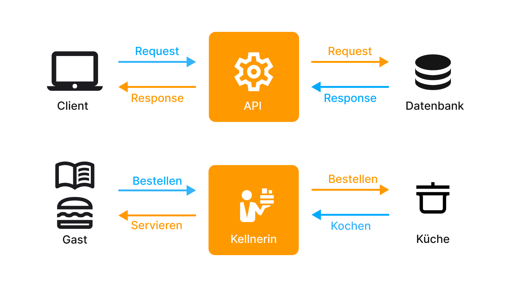
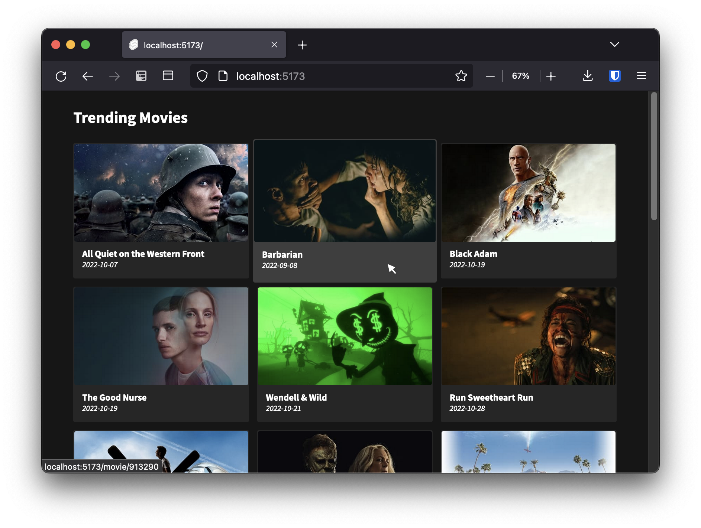
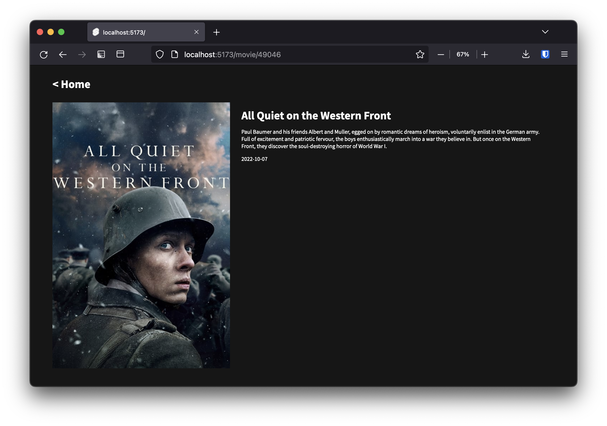

# Movie API

Ziel dieser Übung ist das Bauen einer kleinen Informationsseite über aktuell beliebte Filme.
Die Daten dafür sollen über die API von ["The Movie DB"](https://www.themoviedb.org/) abgefragt und anschließend übersichtlich dargestellt werden.

### Setup

    npm install

### Develop

    npm run dev

### Build

    npm run build

# Was ist eine API?

# Ziel Übung 1: Grid

- Darstellung der Daten der API in einem Grid: Bspw. ein Bild, den Titel, und das Datum.
- Responsives Grid: die Anzahl der Spalten passt sich der verfügbaren Fläche an.
- Komponentisierung: Die Karte ist eine seperate Komponente

### Nützliche Links:

- [Docs zur API](https://developers.themoviedb.org/3/getting-started/introduction)
- [Svelte each loop](https://svelte.dev/docs#template-syntax-each)
- [CSS-Grid](https://css-tricks.com/snippets/css/complete-guide-grid/)

# Ziel Übung 2: Dynamische Unterseite

- Eine neue Seite, die selbst Daten über einen bestimmten Film abfrägt und nähere Information darstellt

### Nützlicher Link:

- [Sveltekit Routing Docs](https://developers.themoviedb.org/3/getting-started/introduction)
